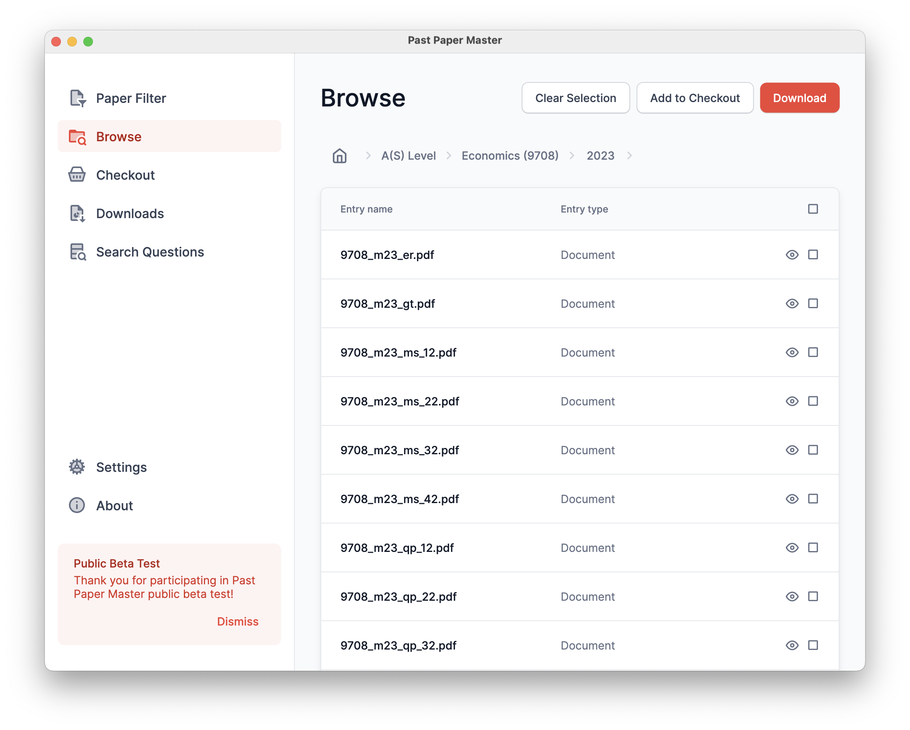
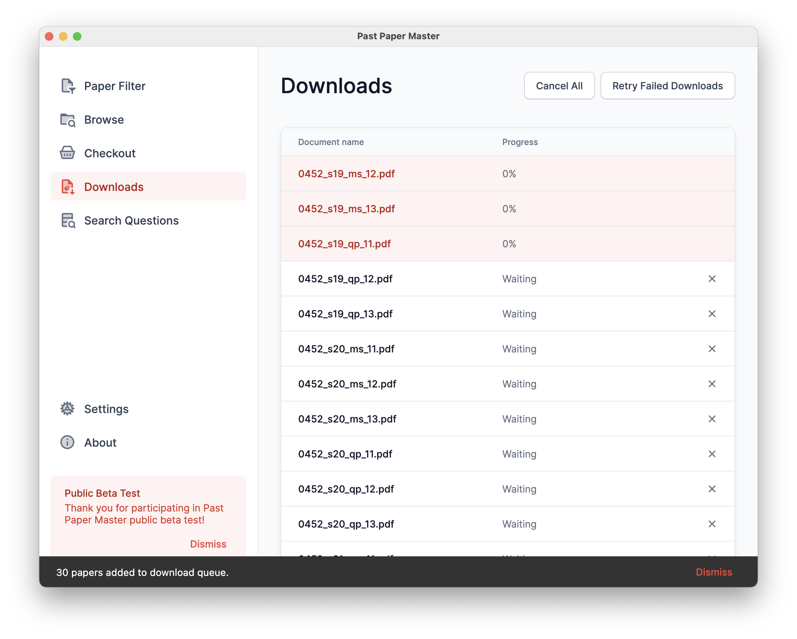

<h1>Past Paper Master</h1>

Past Paper Master is a WIP successor of [Past Paper Finder](https://github.com/SCIEDEV/PastPaperFinder), which is a past paper downloader for IGCSE and A-Level. It is designed to be as simple as possible and easy to use.

## Features

- **Paper Filter**:
  Download multiple past papers with a single click. You can filter with subject, year range, paper numbers, and paper types.
- **Browse Papers**:
  Browse past papers by directory, without requiring internet connection.
- **Checkout**:
  Collect sets of past papers and download them all at once.
- **Search Questions**:
  Search for a past paper question and find the original question paper & mark scheme.

## Installing

You may download Past Paper Finder from the [official website](https://ppm-mu.vercel.app/), or you can build from source as well ;)

## Screenshots

</h1>
</h1>
</h1>
</h1>

## Sponsor

I'm extremely grateful you're considering supporting me. The developer is currently a high school student, so does not have financial resources to pay for hosting (especially for App Store submissions). Therefore, any support is greatly appreciated.

If you are not in China mainland, you can also sponsor me using [Patreon](https://patreon.com/Micfong).

## License

This software is under the [MIT License](LICENSE).
